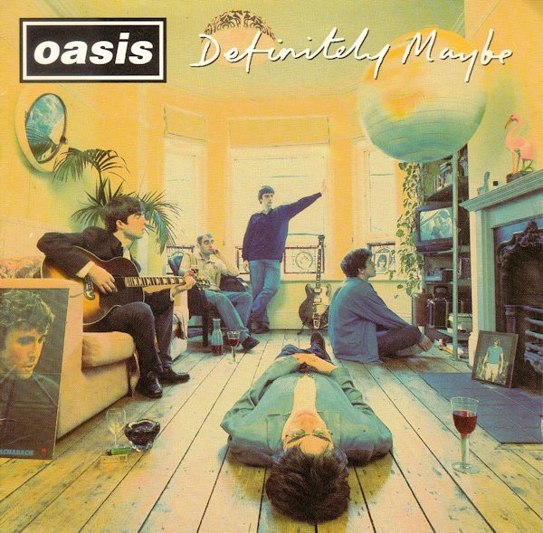
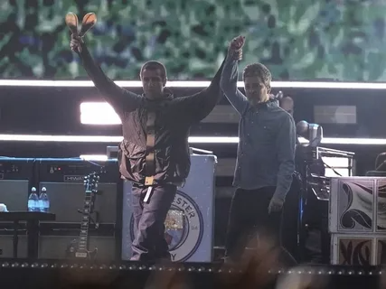

# История брит - поп группы OASIS 🎸


## 1991 - 2009
Группа **Oasis** была образована в Манчестере в 1991 году братьями **Лиамом** и **Ноэлом Галлахерами**. Изначально группа называлась ~~Blur~~ The Rain, но после присоединения **Ноэла Галлахера** к существующему коллективу, он стал автором песен, и название было изменено на **Oasis**. Группа достигла международной славы в 1990-х годах благодаря таким хитам, как _«Supersonic»_, _«Wonderwall»_ и _«Champagne Supernova»_, а также своему дебютному альбому **Definitely Maybe**. После 15 лет напряженных отношений, в 2009 году **Ноэл** покинул группу, заявив, что больше не может работать со своим братом, и **Oasis** распались. 



### Таблица альбомов группы по годам
| Год | Альбом |
|-------|----------|
| 1994     | Definitely Maybe     | 
| 1995     | (What's the Story) Morning Glory?    |
| 1997     | Be Here Now   |
| 2000     | Standing on the Shoulder of Giants   |
| 2002     | Heathen Chemistry  |
| 2005     | Don't Believe the Truth   |
| 2008     | Dig Out Your Soul   |

## OASIS в наше время
В 2025 году группа **Oasis** воссоединилась и начала мировой тур после 16-летнего перерыва. Тур стартовал **4 июля 2025 года** с концерта в Кардиффе. В состав группы вошли братья **Галлахеры, Энди Белл, Джем Арчер, Пол "Бонхед" Артурс и Джои Уоронкер**. После первого этапа в Великобритании и Ирландии, группа планирует выступления и в других странах.



### Фрагмент кода

```
#include <stdio.h>
int main() {
   printf("I'm feeling supersonic!");
   return 0;
}
```
# Ссылки
[PR12_GIT](https://github.com/Pronvaren/PR12_GIT "Всплывающая подсказка") - ссылка на мою работу.